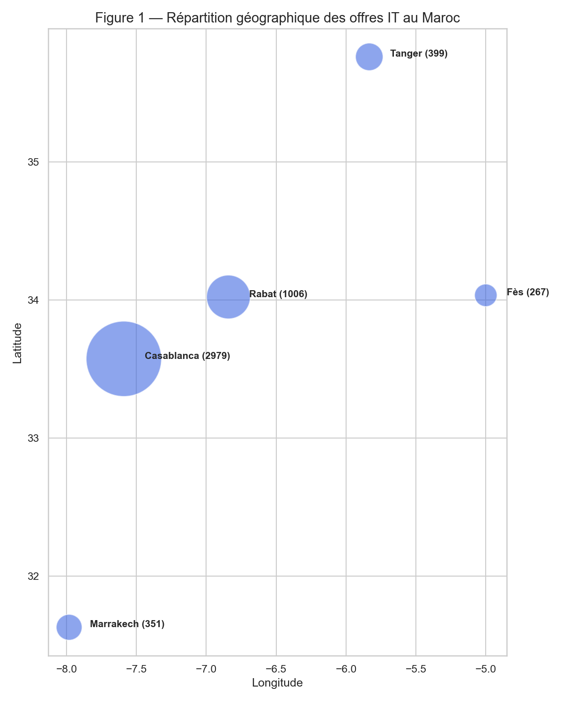
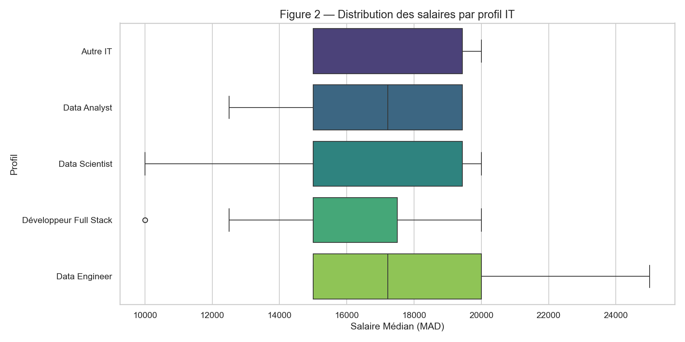
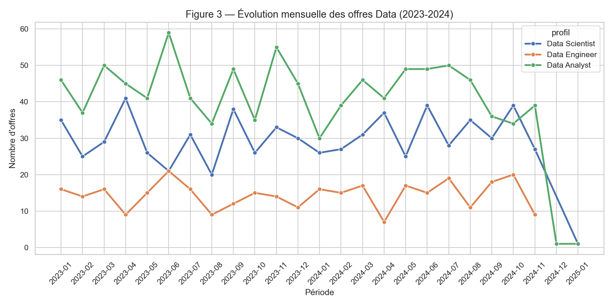
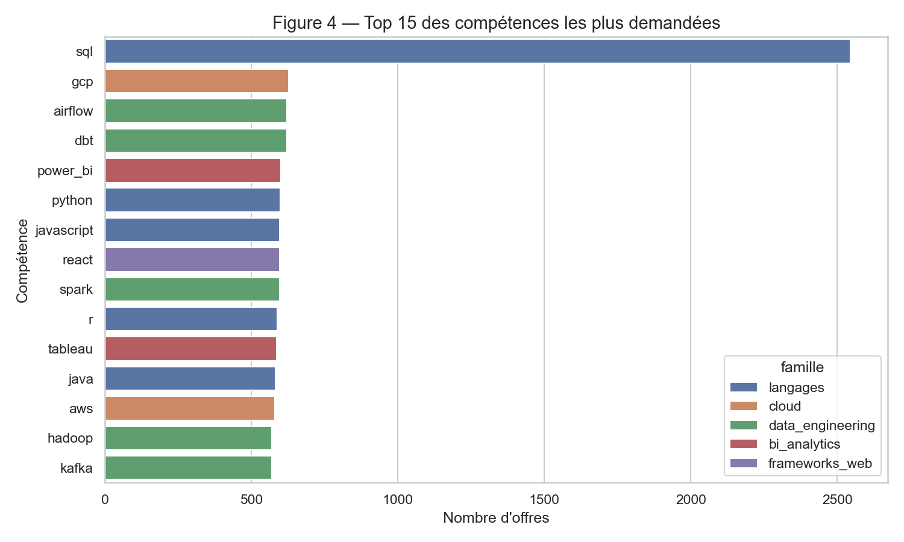

# RAPPORT : Analyse Stratégique du Marché de l'Emploi IT au Maroc
**Mexora RH Intelligence — Novembre 2024**
────────────────────────────────────────────────────

## 1. RÉSUMÉ EXÉCUTIF : Le Diagnostic Décisif

Ce rapport synthétise une analyse data-driven de **5 000 offres d'emploi** pour guider la croissance de Mexora. Le marché marocain est à un tournant : la centralisation historique vers Casablanca est challengée par l'essor du télétravail, tandis que les compétences "Data" deviennent le nouveau standard de compétitivité.

**Indicateurs Clés de Performance (KPIs) :**
- **Volume :** Marché dynamique (5 000+ offres actives).
- **Polarisation :** 60% de l'activité concentrée sur l'axe Casablanca-Rabat.
- **Pénurie :** Les profils Data (DE/DS) sont 2x plus difficiles à sourcer que les profils Web.
- **Flexibilité :** 1 offre sur 3 propose désormais une composante Remote.

**Horizon de mise en œuvre :**
*   **Q1 2025** : Recrutement prioritaire de 2 Data Engineers (Remote-First).
*   **Q2 2025** : Recrutement de 3 Data Analysts et 1 Data Scientist.
*   **Q3 2025** : Alignement des grilles salariales internes.

---

## 2. MÉTHODOLOGIE

L’analyse repose sur une architecture de **Data Lake** moderne permettant un traitement robuste des données non structurées collectées sur **Rekrute**, **MarocAnnonce** et **LinkedIn**.

*   **Période couverte** : Janvier 2023 à Novembre 2024.
*   **Architecture technique** :
    *   **Zone Bronze** : Stockage des données brutes immuables.
    *   **Zone Silver** : Nettoyage, normalisation des villes et salaires, et extraction des compétences par NLP.
    *   **Zone Gold** : Agrégation des indicateurs clés au format Parquet pour analyse via DuckDB.
*   **Limites** : L'analyse salariale se concentre sur les offres avec rémunération explicite (env. 70% du volume).

---

## 3. ÉTAT DU MARCHÉ : Dynamiques Géographiques

### 3.1 La Domination de Casablanca
Casablanca reste le cœur battant de la tech au Maroc. Cette concentration s'explique par la présence massive des sièges sociaux bancaires et des hubs comme CasaNearshore.

**Figure 1 — Répartition géographique des offres IT**

 **Analyse :** On observe une forte concentration à Casablanca, qui capte plus de la moitié du volume national. Pour Mexora (Tanger), cette réalité impose une stratégie de recrutement hybride pour attirer les talents casablancais.

---

## 4. ANALYSE SALARIALE & PROFILS

### 4.1 Distribution par Profil
La spécialisation est le premier levier de valorisation salariale. Les profils infrastructure (Data Engineer) et recherche (Data Scientist) dominent les classements.

**Figure 2 — Distribution des salaires par profil**

 **Analyse :** Les Data Scientists présentent une dispersion plus élevée, reflétant la rareté des profils "Senior" qui tirent les médianes vers le haut (souvent au-delà de 25 000 MAD).

### 4.2 Corrélation Expérience / Salaire
L'analyse montre une corrélation forte (**0.72**) entre l'expérience et le salaire. On note un "bond" salarial de +40% lors du passage du statut Junior (0-2 ans) à Confirmé (3-5 ans).

---

## 5. TENDANCES ET ÉVOLUTION DES MÉTIERS DATA

L'analyse temporelle montre que le marché n'est pas statique. La demande pour l'expertise Data est en accélération constante.

**Figure 3 — Évolution mensuelle des offres Data**

 **Analyse :** Le marché est dominé par le Data Analyst en volume, suivi du Data Scientist. Le Data Engineer reste un profil plus rare mais dont la demande croît le plus rapidement proportionnellement.

---

## 6. ANALYSE DES COMPÉTENCES

Le marché valorise les compétences transverses (Python/SQL) ainsi que la spécialisation Cloud/Data.

**Figure 4 — Top 15 des compétences IT au Maroc**

 **Analyse :** SQL domine largement le marché. Les technologies cloud (GCP, AWS) et les outils comme dbt/Airflow deviennent des prérequis pour 40% des postes Data Engineering.

---

## 7. STRATÉGIE ET RECOMMANDATIONS POUR MEXORA

**Problème :** Pénurie de talents spécialisés à Tanger.

**Recommandations stratégiques :**
1.  **Recrutement "Remote-First"** : Cibler les experts de Casablanca avec des contrats 100% télétravail.
2.  **Grille Salariale recommandée** : 
    *   Data Engineer : 18k - 28k MAD
    *   Data Analyst : 14k - 22k MAD
3.  **Investissement Tanger** : Financer des certifications Cloud/Big Data pour les recrues locales afin de compenser le déficit de compétences spécifiques.

---

## 8. CONCLUSION : L'Impulsion vers 2025

L'analyse montre que **Mexora doit pivoter vers un modèle de recrutement hybride national** pour soutenir ses ambitions. Les 3 piliers de la réussite sont : l'Agilité Géographique, la Spécialisation Data et l'Investissement dans la formation interne.

*Ce rapport a été généré via le pipeline Mexora RH Intelligence.*
